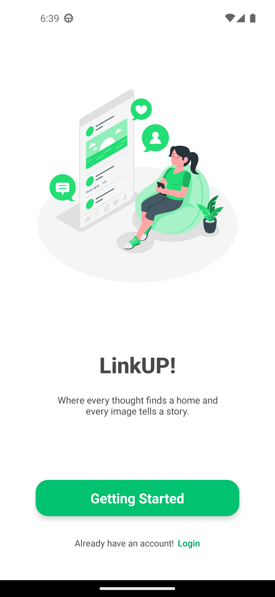
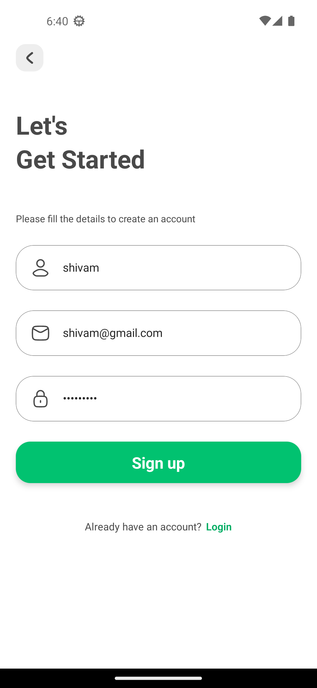
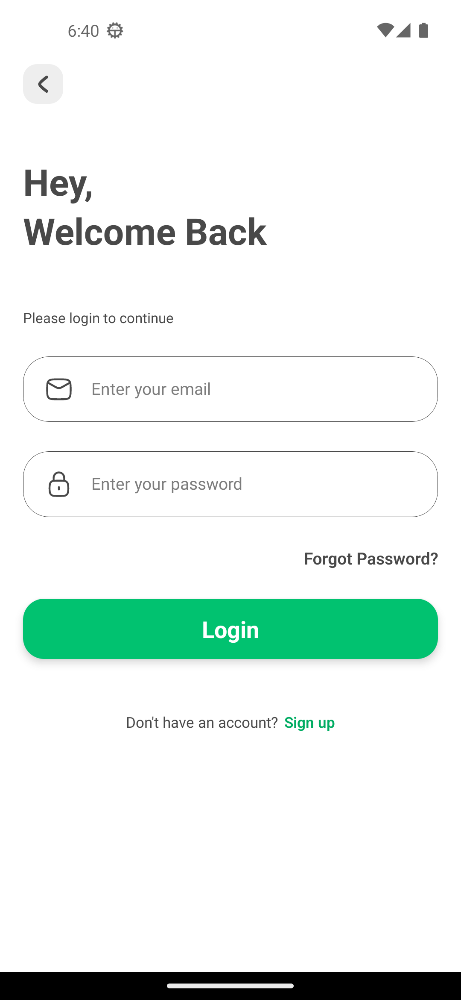
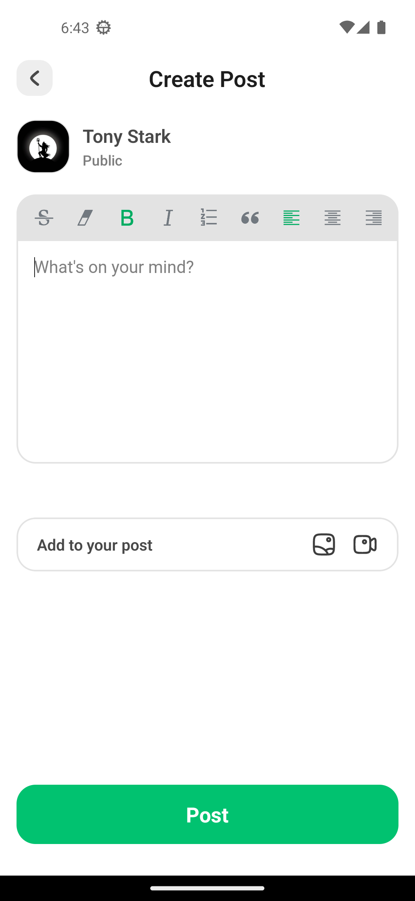
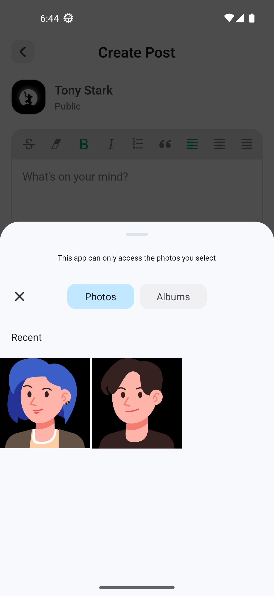
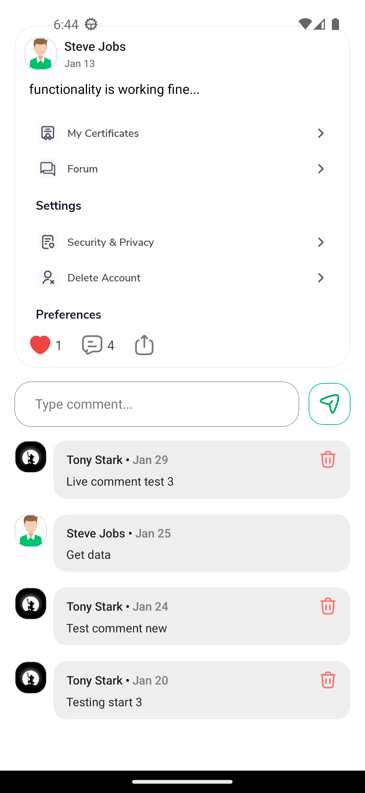
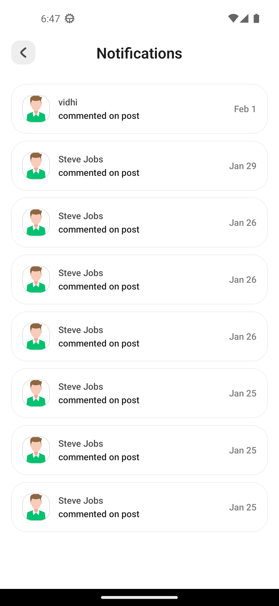
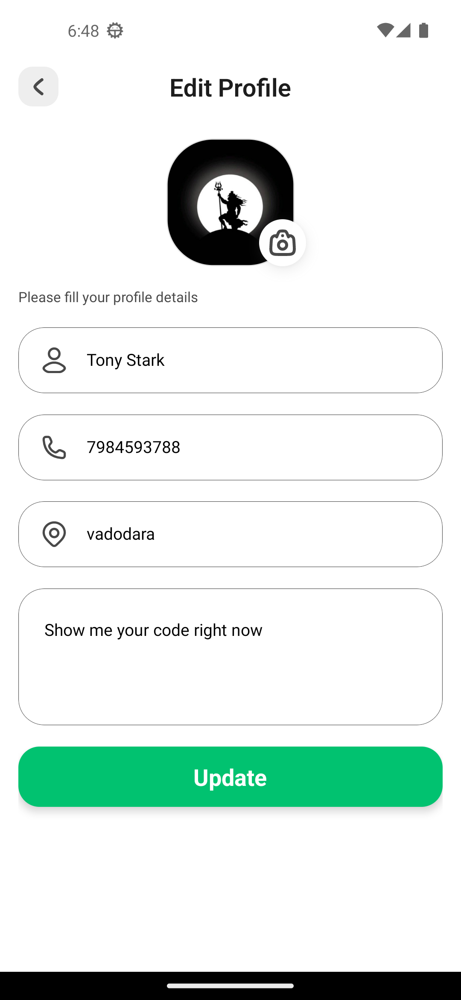
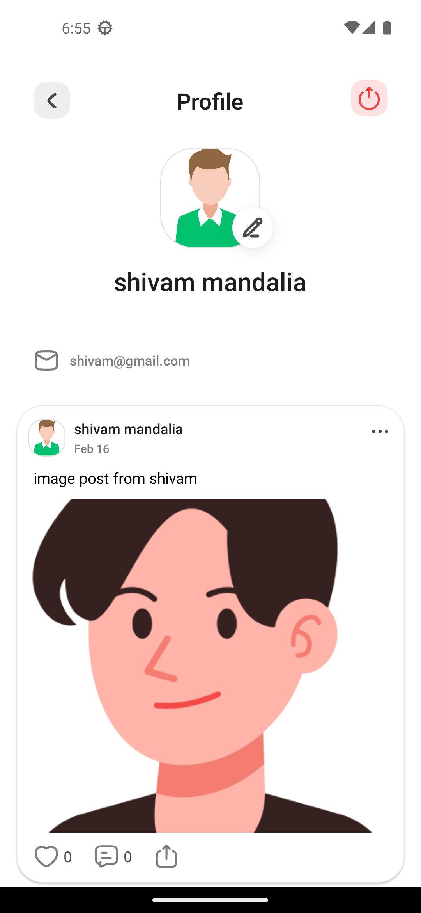
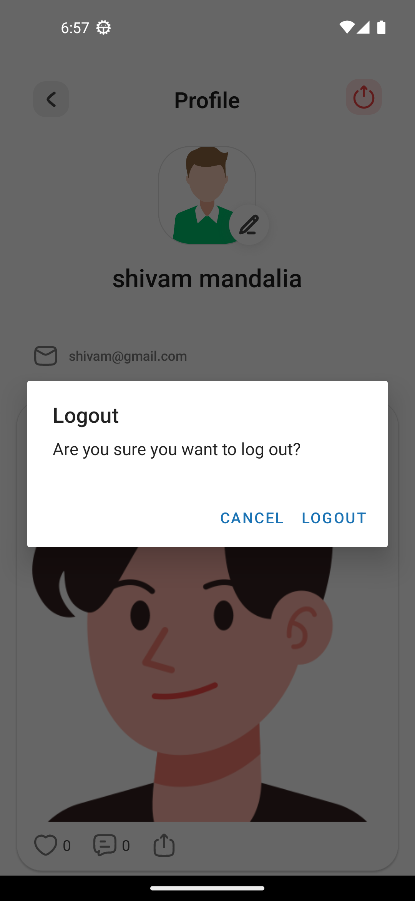

# 📌 Link-Up

🚀 *A real-time social media app built with React Native Expo and Supabase*

---

## **✨ Features**

✅ Create, update, and delete posts\
✅ Like and dislike posts\
✅ Comment on posts (add, update, delete)\
✅ Update user profiles\
✅ Real-time notifications\
✅ Instant updates across all devices

---

## **🛠️ Tech Stack**

**Frontend:** React Native Expo, TypeScript, JavaScript\
**Backend:** Supabase\
**Realtime:** Supabase Realtime

---

## **🚀 Installation & Setup**

1️⃣ **Clone the repository**

```sh
git clone https://github.com/shivam1814/social-media-expo.git
cd linkup-expo
```

2️⃣ **Install dependencies**

```sh
npm install  # or yarn install
```

3️⃣ **Run the app**

```sh
npm run android
or
npm run ios
```

---

## **📸 Screenshots**

<p align="start">
  
  
  
  
  
  
  
  
  
  
  
  
</p>


---

## **📡 Backend (Supabase Schema)**

### **📝 Posts Table**

| Column       | Type      | Description       |
| ------------ | --------- | ----------------- |
| `id`         | UUID (PK) | Unique post ID    |
| `user_id`    | UUID (FK) | Reference to user |
| `content`    | TEXT      | Post content      |
| `image`      | TEXT      | Post image URL    |
| `likes`      | JSONB     | Array of user IDs |
| `created_at` | TIMESTAMP | Time of creation  |

---

## **🔔 Real-Time Updates**

- Supabase **Realtime** enables live updates across all devices.
- Whenever a user likes a post, comments, or updates a profile, all connected devices receive instant updates.

---

## **📌 To-Do & Future Improvements**

### Two major things will implement
1. video and audio call (will use webRTC for it)
2. one to one user and group chat

---

## **🤝 Contributing**

1. Fork the repo
2. Create a new branch (`feat/amazing-feature`)
3. Commit your changes (`git commit -m "Added an amazing feature"`)
4. Push to the branch (`git push origin feat/amazing-feature`)
5. Open a Pull Request

---

## **📬 Contact**

📧 Email: [mandaliashivam72@gmail.com](mailto\:mandaliashivam72@gmail.com)\
🐦 Twitter: [@shivam_mandalia](https://x.com/shivam_mandalia)\
💼 LinkedIn: [Shivam Mandalia](https://www.linkedin.com/in/shivam-mandalia/)
